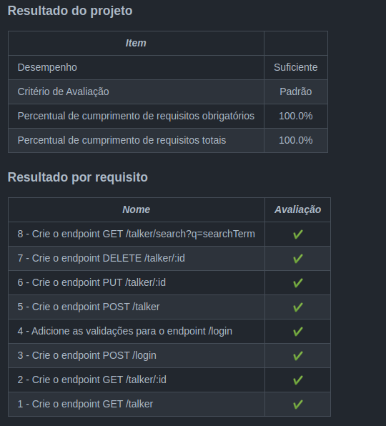

<h1>Sobre</h1>

Quarto projeto do módulo 3 - Back-end, da <a href="https://betrybe.com" target="_blank">Trybe!</a>

Dessa vez foi o projeto Talker Manager. O desafio foi construir uma aplicação de cadastro de palestrantes em que seria possível cadastrar, visualizar, pesquisar, editar e excluir informações.

Para isso desenvolvemos uma API de um CRUD (Create, Read, Update e Delete) com alguns endpoints para ler e escrever utilizando o módulo fs.

<h1>Instalando</h1>

Para instalar, basta executar o comando <code>npm install</code> no diretório raiz do projeto.

Logo depois, rode o comando <code>docker-compose up</code>, também, no diretório raiz do projeto. 

Por fim, execute o comando <code>npm start</code>

<h1>Tecnologias utilizadas</h1>

<ul>
  <li>Node.js</li>
  <li>Express</li>
</ul>

<h1>Aplicação</h1>

<h1>Nota</h1>

 